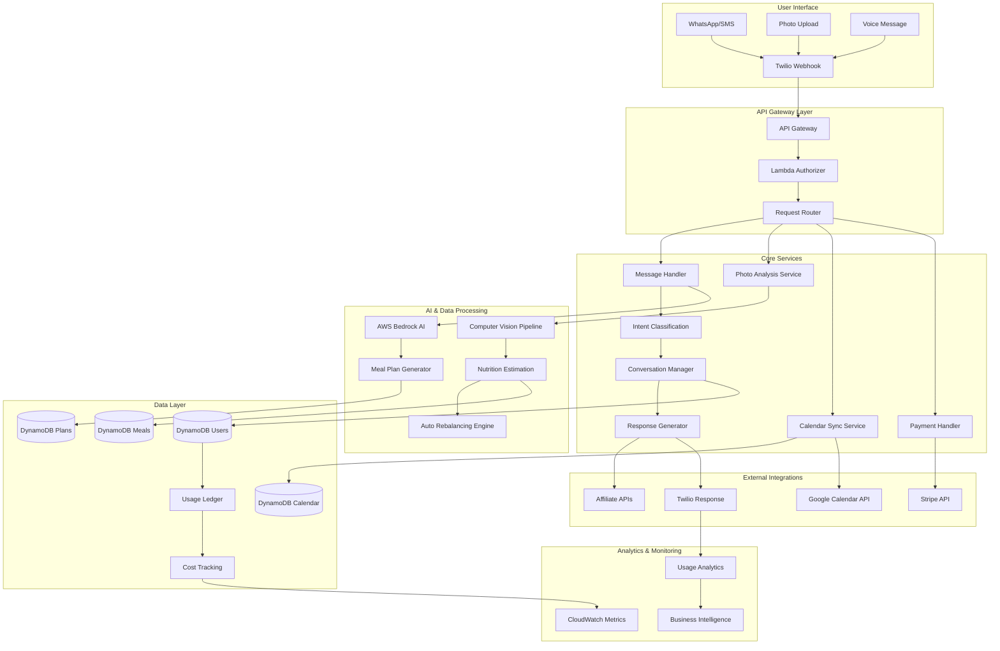
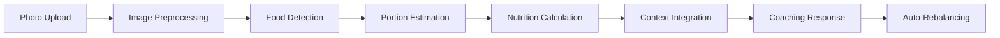
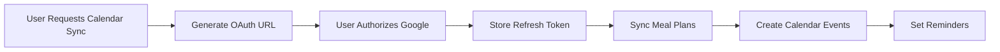
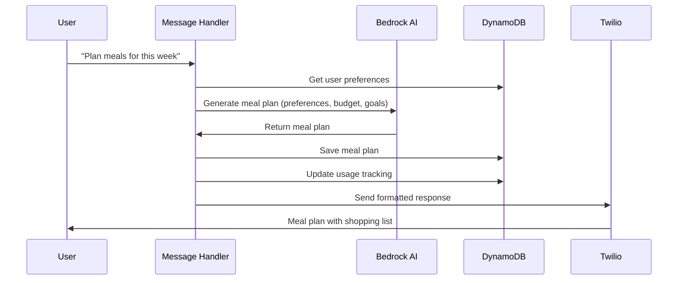
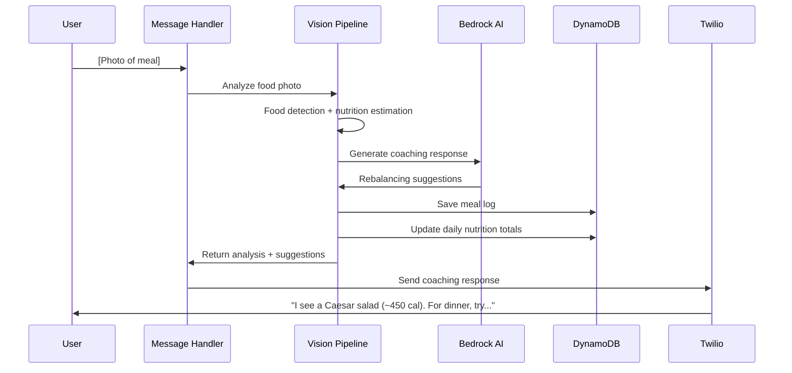
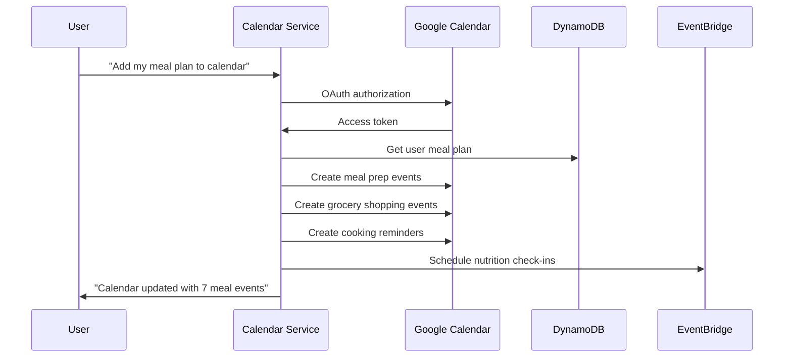

# 🏗️ Architecture Documentation

## System Overview

The AI Nutritionist Assistant is built on a serverless, event-driven architecture that prioritizes cost efficiency, scalability, and user experience. The system processes natural language conversations, visual meal data, and behavioral patterns to provide progressive nutrition coaching.

## 🎯 Core Design Principles

### Progressive Personalization
- **Minimal Initial Data Collection**: Start with allergies + primary goal only
- **Contextual Learning**: Infer preferences from user behavior and feedback  
- **Trust-Based Expansion**: Gradually request more detailed preferences as engagement increases
- **Behavioral Adaptation**: Adjust recommendations based on actual meal choices and ratings

### Event-Driven Architecture
- **Decoupled Services**: Each component can scale independently
- **Async Processing**: Heavy computations don't block user interactions
- **Event Sourcing**: Complete audit trail of user interactions and system decisions
- **Resilience**: Graceful degradation when services are unavailable

### Cost-Conscious Design
- **Usage Tracking**: Real-time monitoring of per-user costs
- **Intelligent Caching**: Aggressive caching of AI responses and nutrition data
- **Rate Limiting**: Dynamic throttling based on subscription tier
- **Resource Optimization**: Right-sized Lambda functions and database capacity

## 🗺️ System Architecture



## 🧠 Core Services

### 1. Message Handler Service

**Purpose**: Processes incoming WhatsApp/SMS messages and routes to appropriate handlers

**Key Components:**
- **Intent Classification**: Determines user intent (meal planning, logging, questions, etc.)
- **Context Manager**: Maintains conversation state and user session data
- **Response Router**: Directs requests to specialized handlers

**Data Flow:**
```python
# Message Processing Pipeline
incoming_message = twilio_webhook_data
user_context = context_manager.get_or_create(user_id)
intent = intent_classifier.classify(message, user_context)
response = intent_handlers[intent].handle(message, user_context)
formatted_response = response_formatter.format(response, user_preferences)
twilio_client.send_message(user_id, formatted_response)
```

### 2. Vision Pipeline Service

**Purpose**: Analyzes food photos to extract nutrition information and provide coaching

**Components:**
- **Food Detection**: AWS Rekognition for object detection
- **Nutrition Estimation**: Custom models for portion size and calorie estimation
- **Context Integration**: Combines visual data with user preferences and goals

**Pipeline:**


**Accuracy Targets:**
- Food identification: 85%+ accuracy
- Portion estimation: ±20% calories
- Processing time: <5 seconds end-to-end

### 3. Progressive Personalization Engine

**Purpose**: Gradually learns user preferences without overwhelming initial onboarding

**Week 1: Foundation**
```python
UserProfile {
    allergies: ["nuts", "shellfish"],
    primary_goal: "save_money",
    budget_range: "tight",  # Inferred from goal
    initial_plan: generate_starter_plan(allergies, goal)
}
```

**Week 2-4: Preference Discovery**
```python
# Gradual data collection based on interactions
if user_rates_meal_low("spicy_thai_curry"):
    user.preferences.spice_tolerance = "mild"
    
if user_substitutes("quinoa", "rice"):
    user.preferences.grain_preference = "familiar_grains"
    
if user_asks_cooking_time():
    user.constraints.max_cooking_time = ask_preference()
```

**Ongoing: Behavioral Learning**
```python
# Pattern recognition from meal logging
analyze_eating_patterns(user.meal_logs) {
    preferred_meal_times: extract_timing_patterns(),
    cuisine_preferences: analyze_cuisine_frequency(),
    portion_preferences: analyze_portion_feedback(),
    seasonal_trends: track_seasonal_changes()
}
```

### 4. Usage Ledger & Cost Control

**Purpose**: Track per-user costs and enforce subscription entitlements

**Cost Tracking:**
```python
class UsageLedger:
    def track_ai_usage(user_id, tokens_used, cost):
        daily_usage = get_daily_usage(user_id)
        daily_usage.ai_tokens += tokens_used
        daily_usage.ai_cost += cost
        
        if daily_usage.ai_cost > get_tier_limit(user_id):
            apply_rate_limiting(user_id)
            suggest_upgrade(user_id)
            
    def track_feature_usage(user_id, feature, count):
        monthly_usage = get_monthly_usage(user_id)
        monthly_usage.features[feature] += count
        
        if exceeds_tier_limit(user_id, feature, count):
            return enforce_limit(user_id, feature)
```

**Entitlement Enforcement:**
```python
class EntitlementManager:
    def check_feature_access(user_id, feature):
        user_tier = get_subscription_tier(user_id)
        feature_limits = TIER_LIMITS[user_tier]
        current_usage = get_current_usage(user_id)
        
        return current_usage[feature] < feature_limits[feature]
```

### 5. Calendar Integration Service

**Purpose**: Syncs meal plans with user calendars and manages scheduling

**OAuth Flow:**


**Calendar Events:**
- **Meal Prep Sessions**: Scheduled based on user availability
- **Grocery Shopping**: Auto-generated lists with timing
- **Cooking Reminders**: Pre-meal notifications with recipe links
- **Nutrition Check-ins**: Weekly progress reviews

### 6. Affiliate Integration Service

**Purpose**: Generates revenue through contextual product recommendations

**Revenue Streams:**
```python
class AffiliateManager:
    def generate_grocery_links(meal_plan, user_location):
        ingredients = extract_ingredients(meal_plan)
        provider = select_provider(user_location, user_preferences)
        
        return {
            "amazon_fresh": build_cart_link(ingredients, "amazon"),
            "instacart": build_cart_link(ingredients, "instacart"),
            "estimated_savings": calculate_affiliate_savings(ingredients)
        }
        
    def recommend_kitchen_tools(user_cooking_patterns):
        missing_tools = analyze_recipe_requirements(user_cooking_patterns)
        return prioritize_recommendations(missing_tools, affiliate_rates)
```

## 📊 Data Models

### User Profile Schema
```python
@dataclass
class UserProfile:
    user_id: str
    phone_number: str
    created_at: datetime
    
    # Progressive personalization data
    preferences: UserPreferences
    goals: NutritionGoals
    constraints: CookingConstraints
    household: Optional[HouseholdData]
    
    # Behavioral data
    meal_history: List[MealLog]
    interaction_patterns: InteractionAnalytics
    personalization_stage: PersonalizationStage
    
    # Business data
    subscription: SubscriptionData
    usage_tracking: UsageLedger
    affiliate_earnings: AffiliateData

@dataclass
class UserPreferences:
    # Week 1: Minimal data
    allergies: List[str]
    dietary_restrictions: List[str]
    primary_goal: str  # "save_money", "lose_weight", "eat_better"
    
    # Week 2-4: Gradual discovery
    cuisines: List[str] = field(default_factory=list)
    spice_tolerance: Optional[str] = None
    cooking_skill: Optional[str] = None
    budget_sensitivity: Optional[str] = None
    
    # Ongoing: Behavioral inference
    meal_timing: Optional[MealTimingPattern] = None
    portion_preferences: Optional[PortionData] = None
    seasonal_preferences: Optional[SeasonalData] = None
```

### Meal Logging Schema
```python
@dataclass
class MealLog:
    log_id: str
    user_id: str
    timestamp: datetime
    
    # Input data
    photo_url: Optional[str]
    text_description: Optional[str]
    voice_note_url: Optional[str]
    
    # Processed data
    detected_foods: List[FoodItem]
    estimated_nutrition: NutritionData
    portion_confidence: float
    
    # User feedback
    user_rating: Optional[int]  # 1-5 stars
    corrections: Optional[List[str]]
    satisfaction: Optional[str]
    
    # Coaching data
    rebalancing_suggestions: List[str]
    goal_progress: GoalProgress
    next_meal_recommendations: List[str]
```

### Subscription & Usage Schema
```python
@dataclass
class SubscriptionData:
    tier: str  # "free", "standard", "premium"
    status: str  # "active", "canceled", "past_due"
    current_period_start: datetime
    current_period_end: datetime
    stripe_subscription_id: str

@dataclass
class UsageLedger:
    user_id: str
    period_start: datetime
    
    # Feature usage
    meal_plans_generated: int
    photos_analyzed: int
    ai_conversations: int
    calendar_syncs: int
    
    # Cost tracking
    ai_tokens_used: int
    ai_cost_usd: float
    vision_api_calls: int
    vision_cost_usd: float
    total_cost_usd: float
    
    # Limits enforcement
    rate_limited_at: Optional[datetime]
    tier_upgrade_suggested: bool
```

## 🔄 Event-Driven Workflows

### Meal Plan Generation Workflow


### Photo Analysis Workflow


### Calendar Sync Workflow


## ⚡ Performance Optimizations

### Caching Strategy
```python
# Multi-level caching for cost optimization
class CacheManager:
    def get_ai_response(self, prompt_hash, user_tier):
        # Level 1: In-memory cache (Lambda container)
        if response := self.memory_cache.get(prompt_hash):
            return response
            
        # Level 2: ElastiCache (cross-Lambda sharing)
        if response := self.redis_cache.get(prompt_hash):
            self.memory_cache.set(prompt_hash, response)
            return response
            
        # Level 3: Generate new response
        response = bedrock_client.generate(prompt)
        
        # Cache based on user tier and content type
        ttl = self.get_cache_ttl(user_tier, response.type)
        self.redis_cache.set(prompt_hash, response, ttl)
        self.memory_cache.set(prompt_hash, response)
        
        return response
```

### Lambda Optimization
```python
# Cold start optimization
@lambda_handler
def message_handler(event, context):
    # Lazy loading of heavy dependencies
    global bedrock_client, dynamodb_client
    
    if not bedrock_client:
        bedrock_client = initialize_bedrock()
    if not dynamodb_client:
        dynamodb_client = initialize_dynamodb()
    
    # Connection pooling for external APIs
    with connection_pool.get_connection() as conn:
        return process_message(event, conn)
```

### Database Optimization
```python
# DynamoDB query optimization
class UserService:
    def get_user_with_preferences(self, user_id):
        # Single query with projection
        response = dynamodb.get_item(
            Key={'user_id': user_id},
            ProjectionExpression='preferences, goals, constraints, usage_tracking'
        )
        return UserProfile.from_dynamo(response['Item'])
    
    def batch_update_usage(self, usage_updates):
        # Batch writes for cost efficiency
        with dynamodb.batch_writer() as batch:
            for update in usage_updates:
                batch.put_item(Item=update.to_dynamo())
```

## 🔐 Security Architecture

### Authentication & Authorization
```python
class SecurityManager:
    def validate_twilio_signature(self, request):
        # Verify webhook authenticity
        expected_signature = calculate_signature(
            request.body, 
            TWILIO_AUTH_TOKEN
        )
        return compare_digest(request.signature, expected_signature)
    
    def check_rate_limits(self, user_id, endpoint):
        # Dynamic rate limiting based on subscription tier
        tier_limits = get_tier_limits(user_id)
        current_usage = get_hourly_usage(user_id, endpoint)
        
        if current_usage >= tier_limits[endpoint]:
            raise RateLimitExceeded(f"Upgrade to continue using {endpoint}")
        
        return True
```

### Data Privacy Controls
```python
class PrivacyManager:
    def anonymize_user_data(self, user_id):
        # GDPR-compliant data anonymization
        user_data = get_user_data(user_id)
        anonymized = {
            'user_id': hash_user_id(user_id),
            'demographics': anonymize_demographics(user_data.demographics),
            'preferences': generalize_preferences(user_data.preferences),
            'meal_patterns': aggregate_meal_patterns(user_data.meals)
        }
        return anonymized
    
    def export_user_data(self, user_id):
        # Data portability compliance
        complete_data = {
            'profile': get_user_profile(user_id),
            'meal_history': get_meal_logs(user_id),
            'conversation_history': get_conversations(user_id),
            'usage_analytics': get_usage_data(user_id)
        }
        return generate_export_package(complete_data)
```

## 📈 Monitoring & Observability

### Business Metrics
```python
class MetricsCollector:
    def track_user_engagement(self, user_id, action):
        metrics = {
            'user_id': user_id,
            'action': action,
            'timestamp': datetime.utcnow(),
            'subscription_tier': get_user_tier(user_id),
            'personalization_stage': get_personalization_stage(user_id)
        }
        
        # Real-time analytics
        cloudwatch.put_metric_data(
            Namespace='AINutritionist/UserEngagement',
            MetricData=[{
                'MetricName': f'Action_{action}',
                'Value': 1,
                'Dimensions': [
                    {'Name': 'SubscriptionTier', 'Value': metrics['subscription_tier']},
                    {'Name': 'PersonalizationStage', 'Value': metrics['personalization_stage']}
                ]
            }]
        )
```

### Cost Monitoring
```python
class CostMonitor:
    def track_per_user_costs(self, user_id, service, cost):
        # Real-time cost tracking
        daily_cost = get_daily_cost(user_id)
        daily_cost[service] += cost
        
        # Alert on cost anomalies
        if daily_cost.total > get_cost_threshold(user_id):
            self.send_cost_alert(user_id, daily_cost)
        
        # Update business metrics
        revenue = get_user_revenue(user_id)
        unit_economics = calculate_unit_economics(daily_cost.total, revenue)
        
        cloudwatch.put_metric_data(
            Namespace='AINutritionist/UnitEconomics',
            MetricData=[{
                'MetricName': 'CostPerUser',
                'Value': daily_cost.total,
                'Dimensions': [{'Name': 'UserTier', 'Value': get_user_tier(user_id)}]
            }]
        )
```

This architecture supports the progressive personalization vision while maintaining cost efficiency and scalability. The event-driven design allows each component to evolve independently while the usage ledger ensures profitability at every scale.
