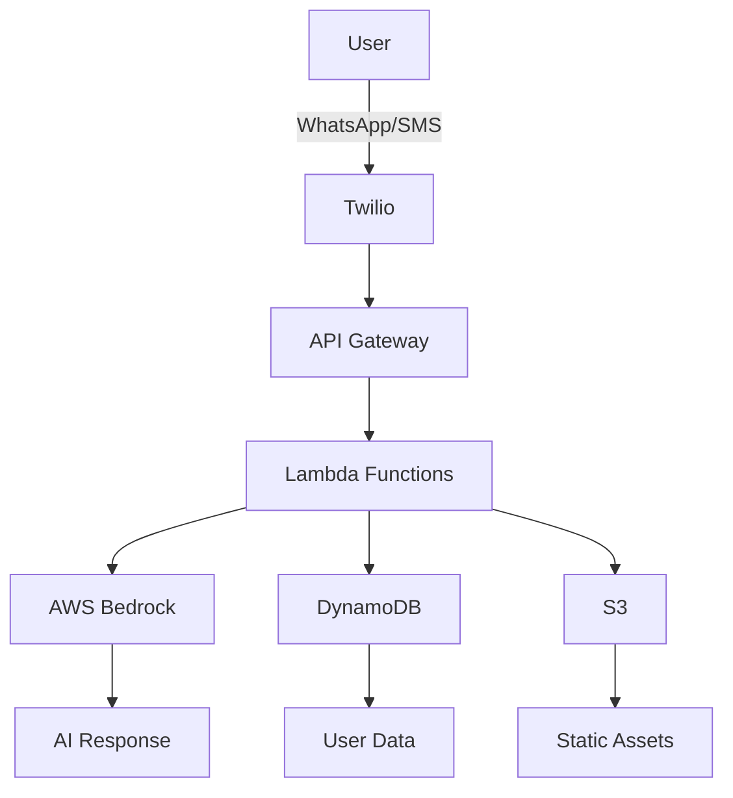

# 🥗 AI Nutritionist Assistant

Welcome to the documentation for the AI Nutritionist Assistant - a state-of-the-art serverless chatbot that provides personalized meal planning through WhatsApp and SMS.

## What is AI Nutritionist Assistant?

The AI Nutritionist Assistant is a conversational AI bot that helps users create personalized, budget-friendly meal plans. Built on AWS serverless architecture and powered by AWS Bedrock, it delivers intelligent nutrition advice through familiar messaging platforms.

### Key Features

- **🤖 AI-Powered**: Uses AWS Bedrock for intelligent meal planning
- **💬 Multi-Platform**: WhatsApp, SMS, and web interface support  
- **💰 Budget-Conscious**: Optimized meal suggestions under $75/week
- **🌍 Global Ready**: Multi-language support and international phone handling
- **🔒 Privacy-First**: GDPR compliant with user data control
- **📊 Analytics**: Comprehensive nutrition tracking and insights

## Quick Links

- [🚀 Quick Start Guide](getting-started/quick-start.md)
- [📖 User Guide](user-guide/using-bot.md)
- [👨‍💻 Developer Guide](developer/architecture.md)
- [🛠️ API Reference](developer/api-reference.md)

## Architecture Overview

## Getting Help

- **Issues**: [GitHub Issues](https://github.com/Owen-Richards/ai-nutritionist/issues)
- **Discussions**: [GitHub Discussions](https://github.com/Owen-Richards/ai-nutritionist/discussions)
- **Email**: support@ai-nutritionist.com

## License

This project is licensed under the MIT License - see the [LICENSE](https://github.com/Owen-Richards/ai-nutritionist/blob/main/LICENSE) file for details.
