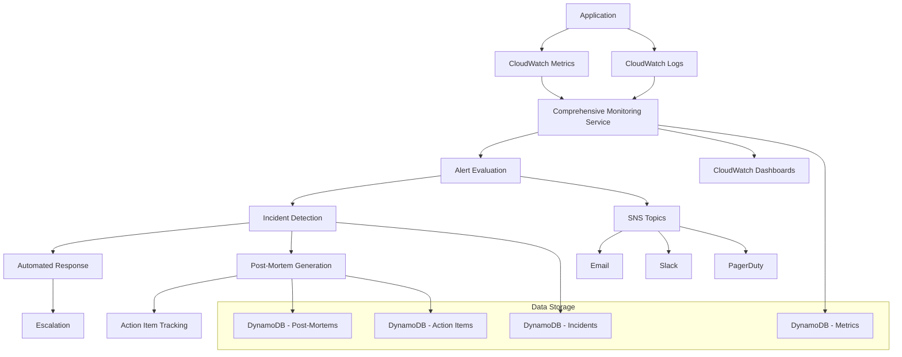

# Comprehensive Monitoring System

## Overview

This comprehensive monitoring system provides complete observability for the AI Nutritionist application, including metrics collection, automated alerting, incident response, and post-mortem automation.

## Features

### 📊 Metrics Collection

- **Application Metrics**: Error rates, response times, request counts
- **Infrastructure Metrics**: Lambda performance, DynamoDB capacity, API Gateway metrics
- **Business Metrics**: Revenue tracking, user engagement, conversion rates
- **Security Metrics**: Security events, failed authentication attempts
- **Cost Metrics**: AWS service costs, cost anomaly detection

### 🚨 Alerting System

- **Multi-tier Alerts**: Low, Medium, High, Critical severity levels
- **Smart Escalation**: Automatic escalation based on severity and response time
- **Multiple Channels**: Email, Slack, PagerDuty, SMS
- **Anomaly Detection**: ML-powered anomaly detection for business metrics

### 🔧 Incident Response

- **Automated Detection**: Real-time incident detection from metrics
- **Automated Response**: Circuit breakers, auto-scaling, service restarts
- **Escalation Management**: Automated team notifications and escalations
- **Runbook Automation**: Predefined response procedures

### 📋 Post-Mortem Automation

- **Auto-Generation**: Automatic post-mortem creation for SEV1/SEV2 incidents
- **Action Item Tracking**: Automated tracking of remediation actions
- **Timeline Analysis**: Detailed timeline reconstruction
- **Lessons Learned**: AI-powered insight extraction

### 📈 Dashboards

- **Main Dashboard**: Overall system health and performance
- **Business Dashboard**: Revenue, engagement, and conversion metrics
- **Infrastructure Dashboard**: Technical infrastructure metrics

## Architecture



## Installation

### Prerequisites

- AWS CLI configured with appropriate permissions
- Terraform >= 1.0
- Python 3.9+
- Bash shell

### Quick Deployment

1. Clone the repository and navigate to the monitoring directory:

```bash
cd ai-nutritionist/
```

2. Make the deployment script executable:

```bash
chmod +x scripts/deploy_monitoring.sh
```

3. Run the deployment:

```bash
./scripts/deploy_monitoring.sh
```

### Manual Deployment

If you prefer manual deployment, follow these steps:

#### 1. Create DynamoDB Tables

```bash
# Metrics table
aws dynamodb create-table \
    --table-name ai-nutritionist-monitoring-metrics \
    --attribute-definitions AttributeName=metric_id,AttributeType=S AttributeName=timestamp,AttributeType=S \
    --key-schema AttributeName=metric_id,KeyType=HASH AttributeName=timestamp,KeyType=RANGE \
    --billing-mode PAY_PER_REQUEST

# Incidents table
aws dynamodb create-table \
    --table-name ai-nutritionist-incidents \
    --attribute-definitions AttributeName=incident_id,AttributeType=S \
    --key-schema AttributeName=incident_id,KeyType=HASH \
    --billing-mode PAY_PER_REQUEST

# Additional tables...
```

#### 2. Deploy Terraform Infrastructure

```bash
cd infrastructure/monitoring
terraform init
terraform plan
terraform apply
```

#### 3. Deploy Lambda Functions

```bash
# Package functions
cd src/services/monitoring
zip -r comprehensive_monitoring.zip comprehensive_monitoring.py config.py

# Deploy
aws lambda create-function \
    --function-name ai-nutritionist-comprehensive-monitoring \
    --runtime python3.9 \
    --role arn:aws:iam::ACCOUNT:role/lambda-execution-role \
    --handler comprehensive_monitoring.lambda_handler \
    --zip-file fileb://comprehensive_monitoring.zip
```

## Configuration

### Environment Variables

Set these environment variables for Lambda functions:

```bash
ENVIRONMENT=production
AWS_REGION=us-east-1
PAGERDUTY_INTEGRATION_KEY=your_key_here
SLACK_WEBHOOK_URL=your_webhook_here
```

### Alert Thresholds

Customize alert thresholds in `src/services/monitoring/config.py`:

```python
"thresholds": {
    "error_rate": {
        "warning": 5.0,      # 5% error rate
        "critical": 10.0     # 10% error rate
    },
    "response_time": {
        "warning": 3000,     # 3 seconds
        "critical": 5000     # 5 seconds
    }
}
```

### SNS Topic Subscriptions

Subscribe to SNS topics for alerts:

```bash
# Technical alerts
aws sns subscribe \
    --topic-arn arn:aws:sns:us-east-1:ACCOUNT:ai-nutritionist-alerts \
    --protocol email \
    --notification-endpoint your-email@domain.com

# Business alerts
aws sns subscribe \
    --topic-arn arn:aws:sns:us-east-1:ACCOUNT:ai-nutritionist-business-alerts \
    --protocol email \
    --notification-endpoint business@domain.com
```

## Usage

### Monitoring Dashboard

Access your monitoring dashboards:

1. **Main Dashboard**: Overall system health

   - URL: `https://console.aws.amazon.com/cloudwatch/home#dashboards:name=AI-Nutritionist-Main-Dashboard`

2. **Business Dashboard**: Business metrics

   - URL: `https://console.aws.amazon.com/cloudwatch/home#dashboards:name=AI-Nutritionist-Business-Dashboard`

3. **Infrastructure Dashboard**: Technical metrics
   - URL: `https://console.aws.amazon.com/cloudwatch/home#dashboards:name=AI-Nutritionist-Infrastructure-Dashboard`

### CloudWatch Insights

Use predefined queries for analysis:

```sql
-- Error Analysis
fields @timestamp, @message, level, error, stack_trace
| filter level = "ERROR"
| sort @timestamp desc
| limit 100

-- Performance Analysis
fields @timestamp, operation, response_time, cache_hit, cost
| filter response_time > 3000
| stats avg(response_time), max(response_time), count() by operation
| sort avg(response_time) desc

-- Business Metrics
fields @timestamp, event, user_id, amount, subscription_tier
| filter event in ["SUBSCRIPTION_EVENT", "MEAL_PLAN_GENERATED", "USER_REGISTERED"]
| stats count() by event, bin(5m)
| sort @timestamp desc
```

### Manual Testing

Test the monitoring system:

```bash
# Test comprehensive monitoring
aws lambda invoke \
    --function-name ai-nutritionist-comprehensive-monitoring \
    --payload '{}' \
    output.json

# Test incident response
aws lambda invoke \
    --function-name ai-nutritionist-incident-response \
    --payload '{"Records":[{"Sns":{"Message":"{\"metric_name\":\"ErrorRate\",\"current_value\":15.0,\"threshold\":10.0}"}}]}' \
    output.json
```

### API Integration

Integrate monitoring into your application:

```python
from src.services.monitoring.comprehensive_monitoring import ComprehensiveMonitoringService

# Initialize monitoring
monitoring = ComprehensiveMonitoringService()

# Track custom metrics
await monitoring.track_business_metric(
    name="meal_plan_generated",
    value=1,
    user_id="user123",
    subscription_tier="premium"
)

# Track performance
await monitoring.track_performance(
    operation="generate_meal_plan",
    duration=1500,  # milliseconds
    success=True,
    cache_hit=False
)
```

## Metrics Reference

### Application Metrics

| Metric       | Description            | Unit         | Threshold                  |
| ------------ | ---------------------- | ------------ | -------------------------- |
| ErrorRate    | Application error rate | Percent      | Warning: 5%, Critical: 10% |
| ResponseTime | Average response time  | Milliseconds | Warning: 3s, Critical: 5s  |
| RequestCount | Total requests         | Count        | N/A                        |
| CacheHitRate | Cache hit percentage   | Percent      | Warning: <60%              |

### Business Metrics

| Metric             | Description             | Unit       | Threshold        |
| ------------------ | ----------------------- | ---------- | ---------------- |
| Revenue            | Hourly revenue          | USD        | Warning: <$50/hr |
| ConversionRate     | Sign-up to subscription | Percent    | Warning: <2%     |
| MealPlansGenerated | Plans created           | Count/hour | Warning: <100/hr |
| ActiveUsers        | Daily active users      | Count      | Trending         |

### Infrastructure Metrics

| Metric            | Description             | Unit         | Threshold                   |
| ----------------- | ----------------------- | ------------ | --------------------------- |
| LambdaDuration    | Function execution time | Milliseconds | Warning: 25s, Critical: 28s |
| DynamoDBThrottles | Throttled requests      | Count        | Warning: 1, Critical: 5     |
| APIGatewayLatency | API response time       | Milliseconds | Warning: 3s, Critical: 5s   |

## Incident Response

### Severity Levels

- **SEV1**: Service completely down, major functionality broken

  - Response: 5 minutes
  - Escalation: 15 minutes
  - Channels: PagerDuty, Phone, Slack

- **SEV2**: Significant functionality impacted

  - Response: 15 minutes
  - Escalation: 30 minutes
  - Channels: PagerDuty, Slack

- **SEV3**: Minor functionality impacted

  - Response: 1 hour
  - Escalation: 2 hours
  - Channels: Slack, Email

- **SEV4**: Cosmetic issues
  - Response: 4 hours
  - Escalation: 8 hours
  - Channels: Email

### Automated Actions

The system can automatically:

1. **Circuit Breaker**: Prevent cascade failures
2. **Auto-scaling**: Increase capacity for performance issues
3. **Service Restart**: Restart failing Lambda functions
4. **Failover**: Switch to backup systems
5. **Alerting**: Notify appropriate teams

### Runbooks

Predefined runbooks for common scenarios:

- High error rate response
- Database performance issues
- Lambda timeout handling
- Revenue drop investigation

## Post-Mortem Process

### Automatic Generation

Post-mortems are automatically generated for SEV1 and SEV2 incidents, including:

- Incident timeline
- Root cause analysis
- Impact assessment
- Action items
- Lessons learned
- Prevention measures

### Action Item Tracking

The system tracks action items from post-mortems:

- Automatic reminders for overdue items
- Progress tracking
- Completion metrics
- Escalation for critical items

## Troubleshooting

### Common Issues

#### 1. Lambda Function Timeouts

```bash
# Check logs
aws logs describe-log-groups --log-group-name-prefix "/aws/lambda/ai-nutritionist"
aws logs filter-log-events --log-group-name "/aws/lambda/ai-nutritionist-comprehensive-monitoring"
```

#### 2. DynamoDB Access Issues

```bash
# Check IAM permissions
aws iam list-attached-role-policies --role-name ai-nutritionist-monitoring-lambda-role
```

#### 3. SNS Delivery Issues

```bash
# Check SNS topic subscriptions
aws sns list-subscriptions-by-topic --topic-arn arn:aws:sns:us-east-1:ACCOUNT:ai-nutritionist-alerts
```

### Debug Mode

Enable debug logging:

```python
import logging
logging.basicConfig(level=logging.DEBUG)
```

### Health Checks

Monitor system health:

```bash
# Check Lambda function status
aws lambda get-function --function-name ai-nutritionist-comprehensive-monitoring

# Check CloudWatch metrics
aws cloudwatch get-metric-statistics \
    --namespace "AI-Nutritionist/Application" \
    --metric-name "ErrorRate" \
    --start-time $(date -u -d '1 hour ago' +%Y-%m-%dT%H:%M:%S) \
    --end-time $(date -u +%Y-%m-%dT%H:%M:%S) \
    --period 300 \
    --statistics Average
```

## Cost Optimization

### Expected Costs

Monthly cost estimates:

- **CloudWatch**: $50-100 (logs, metrics, dashboards)
- **Lambda**: $20-50 (execution costs)
- **DynamoDB**: $30-70 (on-demand pricing)
- **SNS**: $5-15 (notifications)
- **Total**: ~$105-235/month

### Cost Controls

- Log retention: 30 days for application logs
- Metric retention: Standard CloudWatch retention
- DynamoDB: On-demand pricing with burst protection
- Lambda: Optimized memory allocation

## Security

### IAM Permissions

The monitoring system uses least-privilege IAM roles:

```json
{
  "Version": "2012-10-17",
  "Statement": [
    {
      "Effect": "Allow",
      "Action": [
        "cloudwatch:GetMetricStatistics",
        "cloudwatch:PutMetricData",
        "logs:CreateLogGroup",
        "logs:CreateLogStream",
        "logs:PutLogEvents",
        "logs:StartQuery",
        "logs:GetQueryResults"
      ],
      "Resource": "*"
    },
    {
      "Effect": "Allow",
      "Action": [
        "dynamodb:GetItem",
        "dynamodb:PutItem",
        "dynamodb:UpdateItem",
        "dynamodb:Scan",
        "dynamodb:Query"
      ],
      "Resource": "arn:aws:dynamodb:*:*:table/ai-nutritionist-*"
    }
  ]
}
```

### Data Protection

- All data encrypted at rest and in transit
- No sensitive data in logs
- Access logging enabled
- Regular security audits

## Support

### Documentation

- [AWS CloudWatch Documentation](https://docs.aws.amazon.com/cloudwatch/)
- [Terraform AWS Provider](https://registry.terraform.io/providers/hashicorp/aws/latest/docs)
- [PagerDuty API Documentation](https://developer.pagerduty.com/)

### Contact

For support with the monitoring system:

- **Team**: Platform Engineering
- **Slack**: #platform-support
- **Email**: platform@ai-nutritionist.com
- **On-call**: PagerDuty escalation

## Contributing

1. Fork the repository
2. Create a feature branch
3. Make your changes
4. Add tests
5. Submit a pull request

### Development Setup

```bash
# Install dependencies
pip install -r requirements-dev.txt

# Run tests
pytest tests/

# Format code
black src/services/monitoring/

# Type checking
mypy src/services/monitoring/
```

## License

This monitoring system is proprietary to AI Nutritionist. All rights reserved.

---

## Changelog

### v1.0.0 (2024-10-14)

- Initial comprehensive monitoring system
- Multi-tier alerting
- Automated incident response
- Post-mortem automation
- Business metrics tracking
- Cost optimization features
